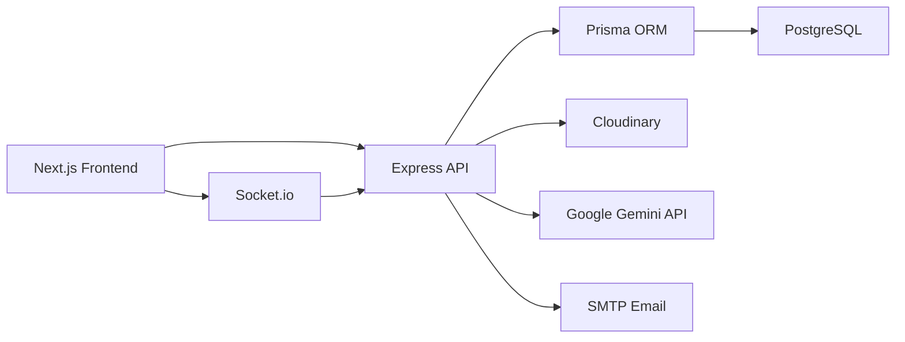

# SyncDoc

SyncDoc is a production-oriented real-time collaborative document workspace inspired by tools like Notion and Google Docs. It combines rich-text editing, live collaboration, document chat, role-based permissions, file sharing, and Gemini-powered writing assistance in a single full-stack application.

This project was built to demonstrate:

- full-stack product design
- real-time communication with conflict protection
- secure RBAC enforcement
- practical AI integration with streaming responses
- production deployment readiness

## What The Project Solves

Most document tools solve either writing, chatting, permissions, or AI assistance separately. SyncDoc brings them together into one workflow:

- users can create and share documents
- teams can edit the same document in real time
- collaborators can chat in the context of the document
- owners can control who can view, edit, or manage access
- users can run AI actions like summarization and grammar improvement

## Architecture



## Tech Stack

### Frontend

- `Next.js (App Router)`: page routing, layouts, and frontend architecture
- `TypeScript`: type safety across UI, store, and API interactions
- `Tailwind CSS`: fast and consistent UI styling
- `Zustand`: lightweight state management for auth, documents, sockets, chat, and AI state
- `TipTap`: rich text editor with structured JSON content

### Backend

- `Node.js`: ideal for I/O-heavy workloads like APIs, sockets, uploads, and streaming
- `Express`: modular REST API structure with middleware support
- `Socket.io`: live collaboration, presence, and chat events
- `JWT`: stateless authentication across HTTP and WebSocket flows
- `bcrypt`: secure password hashing

### Database and Storage

- `PostgreSQL`: relational database for users, documents, collaborators, messages, and files
- `Prisma ORM`: schema modeling, typed queries, and migrations
- `Cloudinary`: hosted file storage for chat attachments

### AI and Communication

- `Google Gemini API`: summarization and grammar/tone improvement with streamed responses
- `Nodemailer`: production password reset email delivery

### Deployment

- `Vercel`: frontend hosting
- `Render`: backend hosting
- `Neon PostgreSQL`: hosted Postgres database

## Core Features

- JWT authentication with registration, login, and password reset
- secure password hashing with bcrypt
- document creation, rename, delete, and sharing
- strict RBAC with `OWNER`, `EDITOR`, and `VIEWER`
- real-time collaborative editing over Socket.io
- real-time document chat
- file upload in chat for images and PDFs
- Gemini AI actions with token-by-token streaming
- optimistic UI for chat and document rename
- TXT and PDF export
- production-ready deployment configuration

## Project Structure

```text
syncdoc-workspace/
+-- backend/
|   +-- prisma/
|   |   +-- schema.prisma
|   +-- src/
|   |   +-- app.ts
|   |   +-- server.ts
|   |   +-- config/
|   |   +-- lib/
|   |   +-- middleware/
|   |   +-- modules/
|   |   |   +-- ai/
|   |   |   +-- auth/
|   |   |   +-- chat/
|   |   |   +-- documents/
|   |   |   +-- permissions/
|   |   |   +-- upload/
|   |   +-- socket/
|   |   +-- types/
|   |   +-- utils/
|   +-- .env.example
|   +-- package.json
|   +-- tsconfig.json
+-- frontend/
|   +-- app/
|   |   +-- (auth)/
|   |   +-- workspace/
|   +-- components/
|   |   +-- auth/
|   |   +-- ui/
|   |   +-- workspace/
|   +-- lib/
|   +-- store/
|   +-- types/
|   +-- .env.example
|   +-- package.json
|   +-- tailwind.config.ts
|   +-- tsconfig.json
+-- render.yaml
+-- package.json
+-- README.md
```

## Database Design

The main schema is defined in `backend/prisma/schema.prisma`.

### Main Tables

- `User`: stores account and authentication data
- `Document`: stores title, rich content, plain text content, owner, and version
- `DocumentUser`: stores document-level roles for collaborators
- `Message`: stores real-time document chat
- `File`: stores uploaded file metadata
- `PasswordResetToken`: stores hashed password reset tokens with expiry

### Why This Schema Works

- `Document.ownerId` provides a clear ownership source of truth
- `DocumentUser` enables many users per document and many documents per user
- unique `(documentId, userId)` prevents duplicate role rows
- `Document.version` supports conflict-safe collaborative editing
- both `content` and `contentText` are stored so the system can support editing, AI processing, and export cleanly

## RBAC Model

SyncDoc uses strict backend-enforced role-based access control.

### Roles

- `VIEWER`: can read the document and participate in chat
- `EDITOR`: can edit the document, chat, and upload files
- `OWNER`: can rename, delete, and manage collaborator permissions

### How RBAC Is Structured

RBAC is modeled with the `DocumentUser` join table.

- `User` and `Document` represent the two primary entities
- `DocumentUser` links a specific user to a specific document
- each link stores a `role`
- backend services check role requirements before allowing actions

### Why We Chose This Approach

- easy to query
- easy to extend
- avoids duplicated permission logic
- supports both ownership and shared access cleanly

## Real-Time Collaboration Approach

SyncDoc uses Socket.io for real-time communication and a version-based concurrency strategy for safe document editing.

### WebSocket Events

- `join-document`
- `leave-document`
- `document-change`
- `chat-message`
- `user-presence`

### How Simultaneous Edits Are Handled

We used a last-write-safe strategy based on document versions.

1. each document has a numeric `version`
2. the client sends edits with `baseVersion`
3. the backend only accepts the update if `baseVersion` matches the latest stored `version`
4. if another user has already written a newer version, the server returns a conflict response and the latest document state
5. the frontend refreshes the editor from server state instead of silently overwriting newer work

### Why We Used This Instead Of OT/CRDT

Operational Transform and CRDTs are more powerful, but they are also more complex. For this project, a version-checking strategy gave a strong trade-off between correctness, simplicity, and implementation speed. It prevents stale writes and keeps the collaboration model understandable in an interview setting.

## How The Main Flows Work

### Authentication Flow

1. user registers or logs in
2. backend hashes passwords with bcrypt
3. backend returns a signed JWT
4. frontend stores the token and uses it for APIs and sockets
5. protected routes validate the JWT before allowing access

### Document Editing Flow

1. frontend loads the document over REST
2. frontend joins the document room through Socket.io
3. user types in TipTap
4. local draft updates immediately in Zustand
5. debounced document updates are sent to backend
6. backend validates role and document version
7. update is saved and broadcast to other users

### Chat Flow

1. user sends a chat message
2. frontend shows it optimistically
3. backend stores the message in Postgres
4. backend broadcasts the confirmed message to the document room

### File Upload Flow

1. user uploads an image or PDF in chat
2. backend validates `EDITOR` or `OWNER`
3. file is uploaded to Cloudinary
4. backend stores file metadata and creates a chat message
5. message is broadcast to the room

### AI Flow

1. user clicks `Summarize` or `Fix Grammar & Tone`
2. frontend sends document text to `/ai/stream`
3. backend validates document access
4. backend sends a prompt to Gemini
5. Gemini response is streamed chunk-by-chunk back to the UI

## Backend APIs

- `POST /auth/register`
- `POST /auth/login`
- `POST /auth/forgot-password`
- `POST /auth/reset-password`
- `GET /auth/me`
- `GET /documents`
- `POST /documents`
- `GET /documents/:documentId`
- `PATCH /documents/:documentId`
- `PUT /documents/:documentId/content`
- `DELETE /documents/:documentId`
- `GET /permissions/:documentId`
- `POST /permissions/:documentId`
- `PATCH /permissions/:documentId/:userId`
- `DELETE /permissions/:documentId/:userId`
- `GET /chat/:documentId/messages`
- `POST /chat/:documentId/messages`
- `POST /upload/:documentId`
- `POST /ai/stream`

## Security Decisions

- passwords are hashed with bcrypt
- JWT is validated for both REST and WebSocket access
- password reset tokens are stored as hashes, not plain text
- `tokenVersion` invalidates old tokens after password reset
- RBAC is enforced on the backend, not just hidden in the frontend
- CORS is explicitly controlled through environment variables

## Local Setup

### 1. Install dependencies

```bash
npm install
npm install --workspace backend
npm install --workspace frontend
```

### 2. Configure environment variables

```bash
cp backend/.env.example backend/.env
cp frontend/.env.example frontend/.env.local
```

Fill in:

- `DATABASE_URL`
- `DIRECT_URL`
- `JWT_SECRET`
- `CLIENT_URL`
- `CORS_ORIGINS`
- `CLOUDINARY_CLOUD_NAME`
- `CLOUDINARY_API_KEY`
- `CLOUDINARY_API_SECRET`
- `GEMINI_API_KEY`
- `SMTP_HOST`
- `SMTP_PORT`
- `SMTP_SECURE`
- `SMTP_USER`
- `SMTP_PASS`
- `MAIL_FROM`
- `NEXT_PUBLIC_API_URL`
- `NEXT_PUBLIC_SOCKET_URL`

### 3. Run Prisma

```bash
npm run prisma:generate --workspace backend
npm run prisma:migrate --workspace backend
```

### 4. Start the app

```bash
npm run dev
```

- Frontend: `http://localhost:3000`
- Backend: `http://localhost:4000`

## Deployment

SyncDoc is configured for:

- frontend on Vercel
- backend on Render
- database on Neon

The root-level `render.yaml` is ready for Render blueprint deployment.

### Production Environment Variables

Backend:

- `NODE_ENV`
- `PORT`
- `DATABASE_URL`
- `DIRECT_URL`
- `JWT_SECRET`
- `JWT_EXPIRES_IN`
- `CLIENT_URL`
- `CORS_ORIGINS`
- `CLOUDINARY_CLOUD_NAME`
- `CLOUDINARY_API_KEY`
- `CLOUDINARY_API_SECRET`
- `GEMINI_API_KEY`
- `GEMINI_MODEL`
- `PASSWORD_RESET_TOKEN_TTL_MINUTES`
- `SMTP_HOST`
- `SMTP_PORT`
- `SMTP_SECURE`
- `SMTP_USER`
- `SMTP_PASS`
- `MAIL_FROM`

Frontend:

- `NEXT_PUBLIC_API_URL`
- `NEXT_PUBLIC_SOCKET_URL`

## Trade-Offs And Future Improvements

### Current Trade-Offs

- real-time collaboration uses version-based conflict handling instead of OT/CRDT
- socket presence is process-local, so horizontal scaling would require Redis or another shared adapter

### Good Next Improvements

- Redis-backed Socket.io adapter for multi-instance backend scaling
- richer editor collaboration features like cursor sharing
- stronger audit logging
- notifications and activity history
- document search and indexing


## Summary

SyncDoc is not a simple CRUD app. It is a full-stack collaborative system with real-time editing, permissions, chat, file sharing, AI assistance, and deployment-ready infrastructure. The project was designed to show practical product engineering decisions, not just isolated feature implementation.
